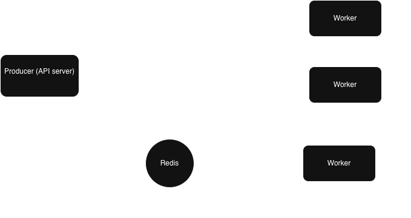
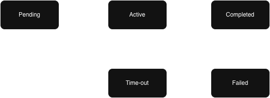

# On-Chain Job Queue — Solana Program

A production-grade job queue system built as a Solana program in Rust using the Anchor framework. This project demonstrates how a core Web2 backend pattern — the background job queue — can be rebuilt as an on-chain state machine, inheriting strong correctness and security guarantees from the protocol itself.

**Deployed Program ID:** `AuQKj9mgG8ZJ54UZS5ahh3jivZig5vzKGffQ8qv4N2Yy`  
**Network:** Devnet  
**Devnet Transaction Links:** *(fill in after deploy)*
- Initialize: `5HSKu1hU8uPPvRs1SP2wFigR5oyYF8fVfd4sR2QujyvfZZwac54kLd43Q8ENYX2uiSxLbojZx87GP2Vr1sxZH7Ho`
- First Job Added: `1xo1K4YTR686b15ex9HyNAj1tEbD4CjDWRhBxpeAmTEQ62b7f5umBy57CJ57aLQr8nGvzqZQWsYrEv8db4AoGkA`
- First Job Claimed: `354DiPEHaz8EjbPepvGWEXkbUhk1QtaXKbFzXuwzHWSng5sEZ2v5M9ywpPxfnmhRjp6ySgMvjpdC3BGdchLPW5rS`
- First Job Completed (in our case, we simulated random failure case): `4N9Hu22UrfstXdPaJMUZHks3GX49xaV8u8tWQ6kC1GhZCkbdYEJt8P878NEjAhqaciQaN4oJB7e4p3Bpkj1VvVv8`

---

## How This Works in Web2

Systems like **BullMQ** (Node.js) and **Sidekiq** (Ruby) are the standard for background job processing. The architecture looks like this:

(simplified)



A job moves through the following states states:




Key Web2 infrastructure requirements:
- **Redis** as a separate broker service — must be deployed, monitored, and kept available
- **Lua scripts / SETNX** for atomic job claiming — prevents two workers from processing the same job
- **Credentials / network ACLs** to restrict which workers can connect to the queue
- **Retry middleware** configured separately for producers (fail fast) vs workers (retry forever)
- **Separate audit logging** infrastructure to record who did what and when
- **Auth middleware** to verify worker identity before allowing job state transitions

---

## How This Works on Solana

The same job lifecycle is implemented as a Solana program. Instead of Redis data structures, jobs are **PDA accounts**. Instead of worker processes polling Redis, workers submit **signed transactions** to the program.

```
Owner wallet
      │
      ▼
add_job instruction ──── creates Job PDA with status=Pending
      │
      ▼
Worker wallet (pre-approved)
      │
      ▼
claim_job instruction ──── atomically flips Job PDA to Active
      │
      ▼
complete_job / fail_job ──── worker updates final status
      │
reclaim_timeout_job ──── any other approved worker can reclaim stalled jobs
```
### Account Structure

| Account | Seeds | Purpose |
|---|---|---|
| `Counter` | `[b"counter"]` | Global monotonic job ID (auto-increment PK) |
| `Owner` | `[b"owner", owner_pubkey]` | Registered job poster |
| `ApprovedWorker` | `[b"approved_worker", owner_pubkey, worker_pubkey]` | Worker authorization — existence = approval |
| `Job` | `[b"job", job_id_le_bytes]` | Single job with full lifecycle state |


### Instructions

| Instruction | Who calls it | What it does |
|---|---|---|
| `initialize` | Anyone (once) | Creates global counter PDA |
| `initialize_owner` | Owner wallet | Registers as a job poster |
| `approve_worker` | Owner | Creates ApprovedWorker PDA for a worker pubkey |
| `add_job` | Owner | Creates a Job PDA with sequential ID |
| `claim_job` | Approved worker | Atomically claims a Pending/Timeout job |
| `complete_job` | Claiming worker | Marks job Completed |
| `fail_job` | Claiming worker | Marks job Failed |
| `reclaim_timeout_job` | Different approved worker | Reclaims stalled Active job past its timeout |
| `close_job` | Job owner | Closes a Completed or Failed job account, returning rent to owner |

## Web2 → Solana Design Analysis

### What the Blockchain Replaces

**Atomic job claiming (zero code written)**
In BullMQ, preventing two workers from claiming the same job requires Redis Lua scripts or `SETNX` atomic operations — explicit distributed locking code you write and maintain. On Solana, transaction ordering is enforced at the protocol level. Only one `claim_job` transaction can win for a given job account. The rest fail automatically. This is not a feature we implemented, it is a property of the execution environment.

**Broker availability (zero configuration)**
Redis is a separate system that can fail independently of your producers and workers. This creates an asymmetric failure problem: a user-facing producer cannot wait for Redis to recover (fail fast), but a background worker should retry indefinitely. BullMQ requires separate `maxRetriesPerRequest` configuration for each. On Solana, the queue *is* the blockchain — there is no separate broker. Producer and worker failure modes are identical and handled by the network.

**Worker authentication (cryptographic by default)**
BullMQ's trust boundary is Redis credentials, anyone with the URL and password can do anything. Worker identity is assumed, not proven. On Solana, every transaction is cryptographically signed. The `ApprovedWorker` PDA system means a worker must be explicitly approved by the owner, and their identity is proven by their wallet signature on every instruction. Cooperative behavior is not assumed, it is enforced at the protocol level.

**Audit trail (free)**
In Web2, recording who claimed what job and when requires a separate audit logging system. On Solana, every state transition is a signed transaction permanently recorded on a public ledger. The full job history is queryable from the chain at zero additional cost.

**Duplicate job prevention (structural)**
BullMQ requires explicit deduplication logic. On Solana, the Job PDA is derived from a globally unique counter-based job ID. The `init` constraint means the program will reject any attempt to create a job at an already-initialized address. Deduplication is structurally impossible to bypass.

### Tradeoffs & Constraints
**Storage is permanent and costs rent**
In Redis, completed jobs can be auto-deleted to free memory. On Solana, accounts persist until explicitly closed. Each Job account costs ~0.002 SOL in rent. For high-volume queues this adds up. Mitigation: implement a `close_job` instruction that closes completed/failed accounts and returns rent to the owner.

**No native cron / scheduler**
BullMQ supports delayed jobs and repeating schedules natively. Solana programs are purely reactive, code only runs when a transaction is submitted. Scheduled job triggering must be handled off-chain (a lightweight cron script calling `claim_job` at the right time). The enforcement logic remains on-chain; only the trigger is off-chain.

**Timeout detection is lazy, not proactive**
In Web2, a background process actively monitors for stalled jobs. On Solana, timeout is checked at the moment `claim_job` or `reclaim_timeout_job` is called. A timed-out job stays in `Active` state until someone interacts with it. This is the standard pattern across Solana DeFi (liquidations, order expiry), off-chain bots trigger, on-chain logic enforces.
Unlike BullMQ which forcibly requeues stalled jobs, timeout here creates a reclaim window, the original worker can still complete the job if they finish before another worker reclaims it. The chain's transaction ordering resolves any race deterministically.

**Transaction latency vs Redis latency**
Redis operations are sub-millisecond. Solana transactions confirm in ~400ms. For latency-sensitive job processing this matters. For typical background job workloads (email, transcoding, data pipelines) it is irrelevant.

**Workers need SOL for transaction fees**
In Web2, workers are free to run. On Solana, every instruction costs a small transaction fee (~0.000005 SOL). For high-throughput queues this is a real operational cost to account for.

---
## Running the Simulation Against Devnet

### Prerequisites
```bash
# Clone the repo
git clone <your-repo>
cd <your-repo>

# Install dependencies
npm install
```

### Setup
Run the setup script — it generates two keypairs and airdrops devnet SOL to both:
```bash
chmod +x setup.sh && ./setup.sh
```

If the airdrop fails (devnet faucet is rate-limited), use the web faucet instead:
https://faucet.solana.com

### Run
The setup script prints the exact commands to run. In two separate terminals:

**Terminal 1 — Owner (posts jobs every 8 seconds, prints dashboard):**
```bash
ts-node scripts/owner.ts keys/owner.json <worker-pubkey>
```

**Terminal 2 — Worker (polls every 3 seconds, claims and processes jobs):**
```bash
ts-node scripts/worker.ts keys/worker.json <owner-pubkey>
```

The worker has a 20% random fail rate to demonstrate the full job lifecycle including timeouts and reclaims. Watch both terminals simultaneously to see job state transitions and race condition handling live.

All transactions are visible on Solana Explorer:
https://explorer.solana.com/address/AuQKj9mgG8ZJ54UZS5ahh3jivZig5vzKGffQ8qv4N2Yy?cluster=devnet


Search your program ID or wallet address to see live activity.`

The owner posts a new job every 8 seconds. The worker polls every 3 seconds, claims jobs FIFO, and has a 20% random fail rate to demonstrate the timeout/reclaim lifecycle. Watch both terminals to see the race condition handling and job state transitions live.

>you may create a third wallet and fund it, then run worker.ts in another terminal pointing to the same owner to watch race condition and timeout reclaims live. Note: remember to approve the new worker, use owner cli for flexibility

### Running Tests
```bash
anchor test
```

Tests cover the full lifecycle including 6 failure cases: duplicate job IDs, unapproved workers, double claiming, wrong claimer completing, premature reclaim, and self-reclaim of timed-out jobs.

---

## Project Structure

```
programs/job_que/src/
  lib.rs              ← Anchor program (instructions, account contexts, structs, errors)
tests/
  job_que.ts          ← Comprehensive test suite
scripts/
  common.ts           ← Shared helpers, PDA derivation, job fetching
  Cli.ts            ← Owner cli
  owner.ts            ← Owner simulation (posts jobs, prints dashboard)
  worker.ts           ← Worker simulation (polls, claims, completes/fails)
```